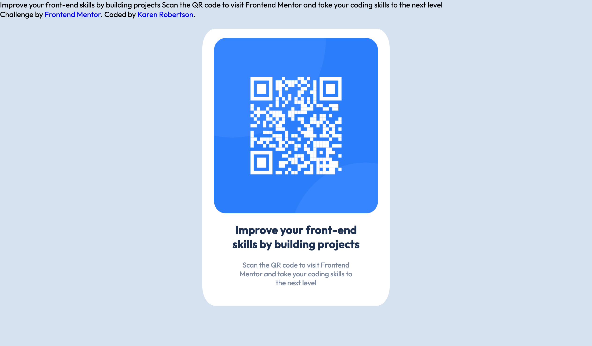
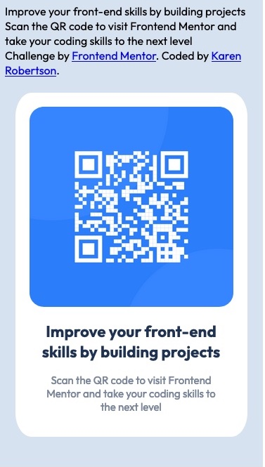

# Frontend Mentor - QR code component solution

This is a solution to the [QR code component challenge on Frontend Mentor](https://www.frontendmentor.io/challenges/qr-code-component-iux_sIO_H). Frontend Mentor challenges help you improve your coding skills by building realistic projects.

## Table of contents

- [Overview](#overview)
  - [Screenshots](#screenshots)
  - [Links](#links)
- [My process](#my-process)
  - [Built with](#built-with)
  - [Continued development](#continued-development)
- [Author](#author)

## Overview

### Screenshots

### Links

- Solution URL: [GitHub](https://github.com/indigorose/Frontend-Mentor-Projects/tree/main/QR_Code_Project/qr-code-component-main)
- Live Site URL: [Live site](https://indigorose-qrcode.netlify.app/)

## My process

### Built with

- Semantic HTML5 markup
- CSS custom properties
- Flexbox
- CSS Grid

### Continued development

This is my first CSS based page in while and I am definitely rusty. Still a good effort but clearly in need of improvement and speed.

## Author

- Frontend Mentor - [@indigorose](https://www.frontendmentor.io/profile/indigorose)
- Twitter - [@Coding_Indigo](https://twitter.com/Coding_Indigo)
